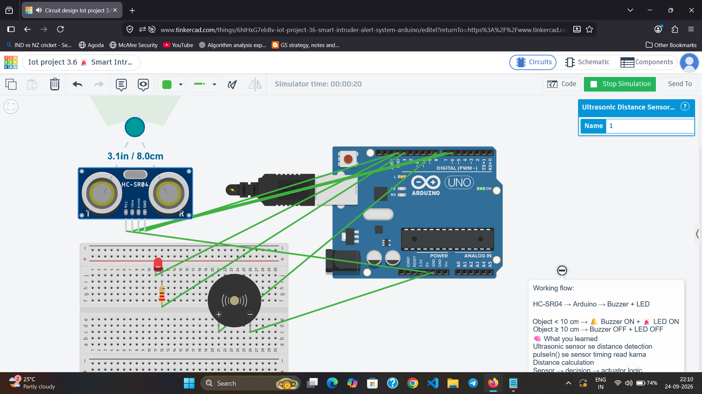

# 🚨 Smart Intruder Alert System

An Arduino-based security system that detects nearby objects using an HC-SR04 ultrasonic sensor and activates an LED and buzzer when an object comes within 10 cm.

## 🎯 Objective

To build a simple intrusion alert system using an Arduino Uno, ultrasonic sensor, LED, and buzzer.

## 🧩 Components

- Arduino Uno
- HC-SR04 Ultrasonic Sensor
- Buzzer
- LED
- 220Ω Resistor
- Breadboard
- Jumper Wires

## 🔌 Circuit Connections

| Component | Arduino |
|---|---|
| HC-SR04 VCC | 5V |
| HC-SR04 GND | GND |
| HC-SR04 TRIG | D7 |
| HC-SR04 ECHO | D6 |
| Buzzer (+) | D8 |
| Buzzer (-) | GND |
| LED (+) | D13 through 220Ω |
| LED (-) | GND |

## ⚙️ Working

The HC-SR04 ultrasonic sensor measures the distance of a nearby object.

- **Distance < 10 cm** → 🚨 LED ON + 🔔 Buzzer ON
- **Distance ≥ 10 cm** → LED OFF + Buzzer OFF

### System Flow

**Object Detection → Ultrasonic Sensor → Arduino → LED + Buzzer Alert**

## 🛠️ Simulation

The project was designed and tested using **Tinkercad Circuits**.

## 📸 Circuit

🔗 **Live Tinkercad Simulation:**  
*Link will be added after the circuit becomes public.*

## 💻 Technology

- Arduino Uno
- C/C++ (Arduino)
- HC-SR04 Ultrasonic Sensor
- Tinkercad Circuits

## 🧠 Concepts Learned

- Ultrasonic distance sensing
- Digital input/output
- `pulseIn()`
- Distance calculation
- Conditional statements
- Sensor-based automation

## 🚀 Future Improvements

- Add PIR motion detection
- Add LCD/OLED display
- Add ESP32 Wi-Fi connectivity
- Send alerts to a mobile/web application

---

### 👩‍💻 Author

**Tanisha Karan**  
B.Tech CSE (IoT) Student
